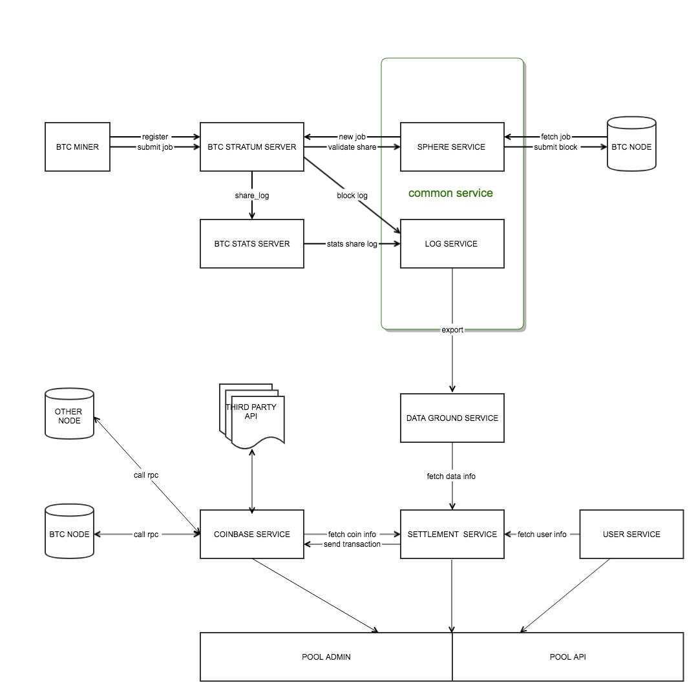
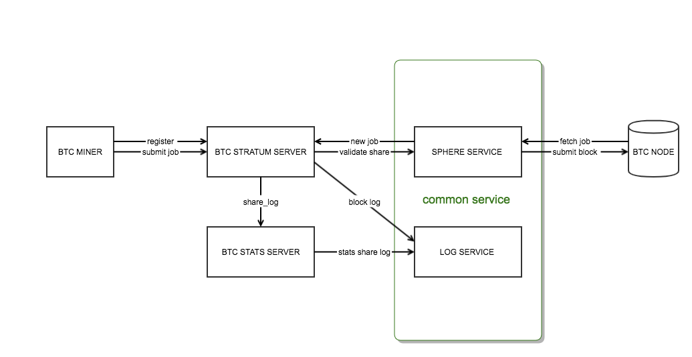

# LAKE POOL
> 这是一个基于golang的开源矿池， 包含[后端](#后端)，前端，中台 三个部分
#### 整体架构图

#后端

### 设计初衷
- 设计一个多币种的挖矿架构
- stratum协议本身是一个消息同步协议，其架构应该尽量同步化
- 矿池支持多个币种本质都是基于stratum协议，其架构因保持一定的复用性，如日志模块，share验证模块， 同时也应该保持一定的独立性，做好资源隔离，例如stratum_server
- 消灭大量无效share_log日志, 减轻后端数据存储压力
- 后端只负责提供数据，而不直接负责业务的结算，数据的业务结算由中台处理
- 采用开发效率的go语言实现

### 后端架构图

### 组件
- [stratum server](backend/stratum_server/README.MD)

- [stats server](backend/stats_server/README.MD) 

- [log server](backend/log_server/README.MD)

- [sphere server](backend/sphere_server/README.MD)

# 中台

# 前端

